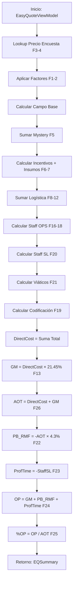

# EasyQuote - Mapeo de Fórmulas Excel → C#

**Versión:** 2025v2  
**Última actualización:** 2026-01-12  
**Motor:** QuoteCalculator.cs  
**Tests:** QuoteCalculatorParityTests.cs (11 tests unitarios)

---

## Resumen Ejecutivo

Este documento mapea las **26 fórmulas principales** del archivo Excel "Ipsos EasyQuote 2025v2.xlsm" a su implementación en C# dentro del motor `QuoteCalculator`. Cada fórmula incluye:

- 📍 **Ubicación en Excel** (rango de celdas aproximado)
- 💻 **Implementación en C#** (línea de código)
- 🔍 **Lógica de negocio**
- 🧪 **Tests asociados** (cuando aplique)
- 📊 **Tablas maestras** involucradas

---

## Índice de Fórmulas

| # | Fórmula | Descripción | Excel | C# | Tests |
|---|---------|-------------|-------|----|----|
| **1** | Parafiscales F2F | Factor 16.522% para F2F | D34 | L68-69 | ✅ |
| **2** | Factor Siembra | 2× cuando siembra activa | D35 | L65 | ✅ |
| **3-4** | Valor Encuesta | Lookup precio por metodología | D33 | L48-62 | ⚠️ |
| **5** | Mystery Shopping | Suma completa de visitas | D73-75 | L96-104 | ⚠️ |
| **6** | Insumos Prueba | ClasePrueba × ProductosTestear | D80 | L118-123 | ⚠️ |
| **7** | Etiquetado/Blind | Factor × Productos × Resp | D81 | L125-130 | ⚠️ |
| **8** | Transporte Niños | 15,000 × Muestra si activo | D85 | L198 | ⚠️ |
| **9** | Transporte Bebidas | 28,000 × Muestra si activo | D86 | L201 | ⚠️ |
| **10** | Envío Volumétrico | Peso volumétrico / 5000 | D87-89 | L229-250 | ⚠️ |
| **11** | Refrigeración | Factor 1.1 + Nevera 970k | D90 | L217-223 | ⚠️ |
| **12** | Reprografía | Páginas × 50 × Muestra | D91 | L258-262 | ⚠️ |
| **13** | GM (Gross Margin) | DirectCost × 21.45% | D100 | L312 | ✅ |
| **14** | Siembra Telefónica | Factor × Muestra | D92 | L178-183 | ⚠️ |
| **15** | Tablets | Patinadores × Tarifa × Ciudades | D93 | L185-193 | ⚠️ |
| **16** | Scripting OPS | Horas × Mult × Tarifa | D94 | L148 | ⚠️ |
| **17** | Harmoni | HorasHarmoni × Tarifa | D95 | L154 | ⚠️ |
| **18** | Graficación | HorasGraficacion × Tarifa | D96 | L156 | ⚠️ |
| **19** | Codificación | Valor × Pregs × (Muestra/100) | D97 | L290-298 | ⚠️ |
| **20** | Staff SL | HorasReal × Tarifa por nivel | D98 | L161-168 | ⚠️ |
| **21** | Viáticos | Override o cálculo por rol/días | D99 | L265-279 | ⚠️ |
| **22** | PB + RMF | -AOT × 4.3% | D101 | L317 | ✅ |
| **23** | ProfTime | -StaffSL | D102 | L320 | ✅ |
| **24** | OP (Operating Profit) | GM + PB_RMF + ProfTime | D103 | L323 | ✅ |
| **25** | %OP | OP / AOT | D104 | L326 | ✅ |
| **26** | AOT (Amount Over Total) | DirectCost + GM | D105 | L315 | ✅ |

**Leyenda:**
- ✅ = Test unitario implementado y pasando
- ⚠️ = Requiere tablas maestras (tested via integración)

---

## Sección 1: Costos de Campo y Recolección

### FORMULA 1: Parafiscales F2F
**Excel:** Celda D34  
**C#:** [QuoteCalculator.cs#L68-69](../../../MatrixNext.Web/Areas/EQ/Services/Internal/QuoteCalculator.cs#L68-L69)

**Lógica:**
```csharp
var factorParafiscal = string.Equals(metodologia, "F2F", StringComparison.OrdinalIgnoreCase) 
    ? 1.16522m 
    : 1m;
var costoCampo = valorEncuesta * totalMuestra * factorSiembra * factorParafiscal;
```

**Descripción:**  
Cuando la metodología es **F2F** (Face-to-Face), se aplica un incremento del **16.522%** sobre el costo base para cubrir parafiscales (prestaciones sociales, seguridad social). Para CATI, Online y otras metodologías, el factor es **1.0** (sin incremento).

**Tests:** ✅ `Formula_FactorParafiscalF2F_16Pct522`, `Formula_CATI_SinParafiscal`

---

### FORMULA 2: Factor Siembra
**Excel:** Celda D35  
**C#:** [QuoteCalculator.cs#L65](../../../MatrixNext.Web/Areas/EQ/Services/Internal/QuoteCalculator.cs#L65)

**Lógica:**
```csharp
var factorSiembra = q.Siembra ? 2m : 1m;
```

**Descripción:**  
Cuando el checkbox **"Siembra"** está activo, el costo de campo se duplica (factor = 2). Esto representa el costo de siembra de encuestas adicionales para aumentar la tasa de respuesta.

**Tests:** ✅ `Formula_FactorSiembra_Duplica`

---

### FORMULA 3-4: Valor Encuesta (Lookup Maestro)
**Excel:** Celda D33  
**C#:** [QuoteCalculator.cs#L48-62](../../../MatrixNext.Web/Areas/EQ/Services/Internal/QuoteCalculator.cs#L48-L62)  
**Tabla:** `eq_param_precio`

**Lógica:**
```csharp
if (string.Equals(metodologia, "CATI", StringComparison.OrdinalIgnoreCase))
{
    valorEncuesta = _masters.GetPrecioEncuesta("CATI", penetracion, duracion, fechaLookup) ?? 0;
}
else if (string.Equals(metodologia, "AUTO", StringComparison.OrdinalIgnoreCase) || 
         string.Equals(metodologia, "Online", StringComparison.OrdinalIgnoreCase))
{
    valorEncuesta = _masters.GetPrecioEncuesta("Online", penetracion, duracion, fechaLookup) ?? 0;
}
else
{
    valorEncuesta = _masters.GetPrecioEncuesta(metodologia, penetracion, duracion, fechaLookup) ?? 0;
}
```

**Descripción:**  
Busca el **precio por encuesta** en la tabla maestra según:
- **MetodologiaCodigo** (F2F, CATI, Online)
- **PenetracionCodigo** (MAS82, ENTRE50Y82, MENOS50, etc.)
- **DuracionMin** (5, 10, 15, 20, 25, 30, 40, 60, 90, 120, 150, 180)
- **FechaCotizacion** (para obtener precios históricos)

**Ejemplo Datos Seed:**
```
MetodologiaCodigo | PenetracionCodigo | DuracionMin | ValorTotal
F2F               | MAS82             | 15          | 20,500
CATI              | MAS82             | 20          | 15,800
Online            | ENTRE50Y82        | 10          | 8,200
```

**Tests:** ⚠️ Requiere BD con maestros seeded

---

### FORMULA 5: Mystery Shopping
**Excel:** Celdas D73-D75  
**C#:** [QuoteCalculator.cs#L96-104](../../../MatrixNext.Web/Areas/EQ/Services/Internal/QuoteCalculator.cs#L96-L104)  
**Tabla:** `eq_tarifa_mystery`

**Lógica:**
```csharp
var costoMystery = 0m;
foreach (var v in mysteryVisits)
{
    var baseTarifa = _masters.GetMysteryTarifa(v.TipoVisita, v.Complejidad)?.VrUnitario ?? 0;
    costoMystery += baseTarifa * Math.Max(1, v.NumOlas);
    costoMystery += (v.Desplazamientos ?? 0) + (v.Tanqueos ?? 0) + (v.Alertas ?? 0);
    costoMystery += (v.Edicion ?? 0) + (v.AlquilerEquipos ?? 0) + (v.CompraDispositivos ?? 0);
}
```

**Descripción:**  
Calcula el costo de **Mystery Shopping** sumando:
1. **Tarifa base** × NumOlas (lookup en tabla por TipoVisita y Complejidad)
2. **Desplazamientos** (viáticos de mystery shoppers)
3. **Tanqueos** (combustible/transporte)
4. **Alertas** (equipos de alerta/grabación)
5. **Edición** (edición de videos/evidencias)
6. **AlquilerEquipos** (equipos de grabación)
7. **CompraDispositivos** (compra de equipos si es necesario)

**Ejemplo Datos Seed:**
```
TipoVisita | Complejidad | VrUnitario | OlasDefault
1          | Baja        | 35,000     | 1
2          | Media       | 50,000     | 2
3          | Alta        | 75,000     | 3
```

**Tests:** ⚠️ Requiere BD con maestros seeded

---

## Sección 2: Incentivos e Insumos

### FORMULA 6: Insumos Prueba
**Excel:** Celda D80  
**C#:** [QuoteCalculator.cs#L118-123](../../../MatrixNext.Web/Areas/EQ/Services/Internal/QuoteCalculator.cs#L118-L123)  
**Tabla:** `eq_factores` (código CLASE_PRUEBA)

**Lógica:**
```csharp
var insumosPrueba = 0m;
if (!string.IsNullOrWhiteSpace(q.ClasePrueba) && 
    !q.ClasePrueba.Equals("No aplica", StringComparison.OrdinalIgnoreCase))
{
    var factorClase = _masters.GetFactorCodigo("CLASE_PRUEBA", q.ClasePrueba);
    insumosPrueba = (factorClase ?? 1m) * Math.Max(q.ProductosTestear, 1);
}
```

**Descripción:**  
Calcula el costo de **insumos de prueba** según el tipo de clase de prueba:
- **Blind Test** (sin identificación)
- **Monádico** (un producto por respondente)
- **Secuencial** (múltiples productos en secuencia)
- **Comparativo** (comparación directa)

**Factor × ProductosTestear**

**Ejemplo Factores:**
```
TipoCodigo    | Codigo      | ValorDecimal
CLASE_PRUEBA  | Blind       | 1.2
CLASE_PRUEBA  | Monadico    | 1.0
CLASE_PRUEBA  | Secuencial  | 1.5
CLASE_PRUEBA  | Comparativo | 1.8
```

**Tests:** ⚠️ Requiere BD con factores

---

### FORMULA 7: Etiquetado/Blind
**Excel:** Celda D81  
**C#:** [QuoteCalculator.cs#L125-130](../../../MatrixNext.Web/Areas/EQ/Services/Internal/QuoteCalculator.cs#L125-L130)  
**Tabla:** `eq_factores` (código ETIQUETADO)

**Lógica:**
```csharp
var costoEtiquetado = 0m;
if (!string.IsNullOrWhiteSpace(q.EtiquetadoTipo) && 
    !q.EtiquetadoTipo.Equals("No", StringComparison.OrdinalIgnoreCase))
{
    var factorEtiq = _masters.GetFactorCodigo("ETIQUETADO", q.EtiquetadoTipo);
    costoEtiquetado = (factorEtiq ?? 0) * Math.Max(q.ProductosTestear, 1) * Math.Max(q.ProductosPorResp, 1);
}
```

**Descripción:**  
Costo de **etiquetado ciego** (blind labeling) o **rotulación** de productos para pruebas:
- **Factor** × **ProductosTestear** × **ProductosPorResp**

**Ejemplo Factores:**
```
TipoCodigo  | Codigo          | ValorDecimal
ETIQUETADO  | Basico          | 500
ETIQUETADO  | Personalizado   | 1,200
ETIQUETADO  | Premium         | 2,500
```

**Tests:** ⚠️ Requiere BD con factores

---

## Sección 3: Logística y Transporte

### FORMULA 8: Transporte Niños
**Excel:** Celda D85  
**C#:** [QuoteCalculator.cs#L198](../../../MatrixNext.Web/Areas/EQ/Services/Internal/QuoteCalculator.cs#L198)

**Lógica:**
```csharp
var transporteNinos = logistica.EstudioNinos ? 15000m * totalMuestra : 0;
```

**Descripción:**  
Si el estudio involucra **niños** (checkbox `EstudioNinos`), se añade un costo fijo de **$15,000 por encuesta** para transporte especializado.

**Tests:** ⚠️ Validación en tests de integración

---

### FORMULA 9: Transporte Bebidas/Producto
**Excel:** Celda D86  
**C#:** [QuoteCalculator.cs#L201](../../../MatrixNext.Web/Areas/EQ/Services/Internal/QuoteCalculator.cs#L201)

**Lógica:**
```csharp
var transporteBebidas = logistica.TaxiParticipantes ? 28000m * totalMuestra : 0;
```

**Descripción:**  
Si el estudio requiere **taxi para participantes** (checkbox `TaxiParticipantes`), se añade **$28,000 por encuesta** para transporte de productos/bebidas.

**Tests:** ⚠️ Validación en tests de integración

---

### FORMULA 10: Envío Volumétrico
**Excel:** Celdas D87-D89  
**C#:** [QuoteCalculator.cs#L229-250](../../../MatrixNext.Web/Areas/EQ/Services/Internal/QuoteCalculator.cs#L229-L250)  
**Tabla:** `eq_envio_tarifa`, `eq_envio_parametros`

**Lógica:**
```csharp
if (methodology.EnvioCiudades && methodology.PesoProductoGr > 0)
{
    var pesoKgReal = methodology.PesoProductoGr / 1000m;
    var divisorVol = _masters.GetMisc("DIVISOR_VOLUMETRICO")?.ValorDecimal ?? 5000m;
    
    var pesoVolumetrico = pesoKgReal;
    if (logistica.DimensionLargoCm > 0 && logistica.DimensionAnchoCm > 0 && logistica.DimensionAltoCm > 0)
    {
        pesoVolumetrico = (logistica.DimensionLargoCm * logistica.DimensionAnchoCm * logistica.DimensionAltoCm) / divisorVol;
    }
    
    var pesoKg = Math.Max(pesoKgReal, pesoVolumetrico);
    var tipologia = ciudadesActivas <= 1 ? "URBANO" : "NACIONAL";
    var tarifaEnv = _masters.GetEnvio(tipologia);
    
    var adicionalKg = Math.Max(0m, pesoKg - 1m);
    var seguro = Math.Max(tarifaEnv.ValorDeclaradoMin * tarifaEnv.SeguroPct, 0);
    var costoUnit = tarifaEnv.KiloInicial + adicionalKg * tarifaEnv.KiloAdicional + seguro;
    costoEnvio = costoUnit * ciudadesActivas;
}
```

**Descripción:**  
Calcula costo de **envío de productos** usando:
1. **Peso Real** = PesoProductoGr / 1000
2. **Peso Volumétrico** = (Largo × Ancho × Alto) / 5000
3. **Peso Cobrable** = MAX(PesoReal, PesoVolumetrico)
4. **Tarifa** = KiloInicial + (PesoCobrable - 1) × KiloAdicional + Seguro
5. **Costo Total** = Tarifa × CiudadesActivas

**Ejemplo Tarifa:**
```
Tipologia  | KiloInicial | KiloAdicional | SeguroPct | ValorDecMin
URBANO     | 12,500      | 2,800         | 0.005     | 50,000
NACIONAL   | 18,000      | 4,200         | 0.008     | 50,000
```

**Tests:** ⚠️ Requiere BD con tarifas de envío

---

### FORMULA 11: Refrigeración
**Excel:** Celda D90  
**C#:** [QuoteCalculator.cs#L217-223](../../../MatrixNext.Web/Areas/EQ/Services/Internal/QuoteCalculator.cs#L217-L223)  
**Tabla:** `eq_misc_params` (FACTOR_REFRIGERACION, COSTO_NEVERA)

**Lógica:**
```csharp
if (q.Refrigeracion)
{
    var factorRef = _masters.GetMisc("FACTOR_REFRIGERACION")?.ValorDecimal ?? 1.1m;
    costoLocaciones *= factorRef;
    var costoNevera = _masters.GetMisc("COSTO_NEVERA")?.ValorDecimal ?? 970000m;
    costoLocaciones += costoNevera;
}
```

**Descripción:**  
Si el estudio requiere **refrigeración** (productos perecederos):
1. **Incremento** del 10% en costo de locaciones (factor 1.1)
2. **Costo fijo** de nevera: $970,000

**Tests:** ⚠️ Validación con parámetros misc

---

### FORMULA 12: Reprografía
**Excel:** Celda D91  
**C#:** [QuoteCalculator.cs#L258-262](../../../MatrixNext.Web/Areas/EQ/Services/Internal/QuoteCalculator.cs#L258-L262)  
**Tabla:** `eq_misc_params` (COSTO_REPROGRAFIA_PAGINA)

**Lógica:**
```csharp
if (logistica.ReprografiaPaginas > 0)
{
    var factorReprograf = _masters.GetMisc("COSTO_REPROGRAFIA_PAGINA")?.ValorDecimal ?? 50m;
    costoReprografia = logistica.ReprografiaPaginas * factorReprograf * totalMuestra;
}
```

**Descripción:**  
Costo de **fotocopias/impresiones**:
- **Páginas** × **CostoPorPágina** × **Muestra**
- CostoPorPágina default: $50

**Tests:** ⚠️ Validación con parámetros misc

---

## Sección 4: Staff y Procesamiento

### FORMULA 13: GM (Gross Margin)
**Excel:** Celda D100  
**C#:** [QuoteCalculator.cs#L312](../../../MatrixNext.Web/Areas/EQ/Services/Internal/QuoteCalculator.cs#L312)

**Lógica:**
```csharp
var gmOps = directCost * 0.2145m;
```

**Descripción:**  
**Margen bruto** fijo del **21.45%** sobre el costo directo total.

**Ejemplo:**
```
DirectCost = 10,000,000
GM = 10,000,000 × 0.2145 = 2,145,000
```

**Tests:** ✅ `Formula_GM_21Pct45_Correcto`

---

### FORMULA 14: Siembra Telefónica
**Excel:** Celda D92  
**C#:** [QuoteCalculator.cs#L178-183](../../../MatrixNext.Web/Areas/EQ/Services/Internal/QuoteCalculator.cs#L178-L183)  
**Tabla:** `eq_factores` (código APOYO_RECLUTAMIENTO)

**Lógica:**
```csharp
if (!string.IsNullOrWhiteSpace(logistica.ApoyoReclutamientoTipo))
{
    var factorApoyo = _masters.GetFactorCodigo("APOYO_RECLUTAMIENTO", logistica.ApoyoReclutamientoTipo) ?? 1m;
    costoSiembraTel = factorApoyo * totalMuestra;
}
```

**Descripción:**  
Costo de **siembra telefónica** para reclutamiento:
- **FactorApoyo** × **Muestra**

**Ejemplo Factores:**
```
TipoCodigo          | Codigo      | ValorDecimal
APOYO_RECLUTAMIENTO | Basico      | 2,500
APOYO_RECLUTAMIENTO | Completo    | 5,000
APOYO_RECLUTAMIENTO | Premium     | 8,500
```

**Tests:** ⚠️ Requiere BD con factores

---

### FORMULA 15: Tablets
**Excel:** Celda D93  
**C#:** [QuoteCalculator.cs#L185-193](../../../MatrixNext.Web/Areas/EQ/Services/Internal/QuoteCalculator.cs#L185-L193)  
**Tabla:** `eq_misc_params` (COSTO_TABLET)

**Lógica:**
```csharp
if (q.PatinadoresCiudad > 0)
{
    var tarifaTablet = _masters.GetMisc("COSTO_TABLET")?.ValorDecimal ?? 25000m;
    costoTablets = q.PatinadoresCiudad * tarifaTablet * sampleCities.Count(x => x.Activa);
    if (costoTablets == 0)
    {
        costoTablets = q.PatinadoresCiudad * tarifaTablet;
    }
}
```

**Descripción:**  
Costo de **tablets/dispositivos** para patinadores (street intercept):
- **Patinadores** × **TarifaTablet** × **CiudadesActivas**
- TarifaTablet default: $25,000

**Tests:** ⚠️ Validación con parámetros misc

---

### FORMULA 16: Scripting OPS
**Excel:** Celda D94  
**C#:** [QuoteCalculator.cs#L148](../../../MatrixNext.Web/Areas/EQ/Services/Internal/QuoteCalculator.cs#L148)  
**Tabla:** `eq_param_script_proc`, `eq_cost_unitario_ops`

**Lógica:**
```csharp
decimal MultScript(string tipo) => tipo?.ToLowerInvariant() switch
{
    "duplicado" => 4m,
    "reutilizacion" => 2m,
    _ => 1m
};

var costoScripting = q.Scripting 
    ? horas.HorasScript * MultScript(q.ScriptingTipo) * TarifaOps("Scripting", tarifaOpsDefault) 
    : 0;
```

**Descripción:**  
Costo de **programación de cuestionario**:
- **HorasScript** (de tabla según duración) × **Multiplicador** × **Tarifa**

**Multiplicadores:**
- Lógica Simple: 1×
- Reutilización: 2×
- Duplicado: 4×

**Tests:** ⚠️ Requiere BD con horas y tarifas

---

### FORMULA 17: Harmoni
**Excel:** Celda D95  
**C#:** [QuoteCalculator.cs#L154](../../../MatrixNext.Web/Areas/EQ/Services/Internal/QuoteCalculator.cs#L154)  
**Tabla:** `eq_param_script_proc`, `eq_cost_unitario_ops`

**Lógica:**
```csharp
var costoHarmoni = q.Harmoni 
    ? horas.HorasHarmoni * TarifaOps("Harmoni", tarifaOpsDefault) 
    : 0;
```

**Descripción:**  
Costo de **procesamiento Harmoni** (herramienta de análisis):
- **HorasHarmoni** × **TarifaOPS**

**Tests:** ⚠️ Requiere BD con horas y tarifas

---

### FORMULA 18: Graficación
**Excel:** Celda D96  
**C#:** [QuoteCalculator.cs#L156](../../../MatrixNext.Web/Areas/EQ/Services/Internal/QuoteCalculator.cs#L156)  
**Tabla:** `eq_param_script_proc`, `eq_cost_unitario_ops`

**Lógica:**
```csharp
var costoGraf = q.Graficacion 
    ? horas.HorasGraficacion * TarifaOps("Graficacion", tarifaOpsDefault) 
    : 0;
```

**Descripción:**  
Costo de **graficación/visualización de datos**:
- **HorasGraficacion** × **TarifaOPS**

**Tests:** ⚠️ Requiere BD con horas y tarifas

---

### FORMULA 19: Codificación
**Excel:** Celda D97  
**C#:** [QuoteCalculator.cs#L290-298](../../../MatrixNext.Web/Areas/EQ/Services/Internal/QuoteCalculator.cs#L290-L298)  
**Tabla:** `eq_codificacion_param`

**Lógica:**
```csharp
if (q.Codificacion && (q.PregAbiertas > 0 || q.PregAbiertasMult > 0))
{
    var cod = _masters.GetCodificacionDefault();
    if (cod != null)
    {
        var cantidadRegs = totalMuestra;
        costoCodif = cod.ValorIpsos * (q.PregAbiertas + q.PregAbiertasMult * 1.5m) * (cantidadRegs / 100m);
    }
}
```

**Descripción:**  
Costo de **codificación de preguntas abiertas**:
- **ValorBase** × **(PregSimples + PregMultiples × 1.5)** × **(Muestra / 100)**

**Ejemplo:**
```
PregAbiertas = 3
PregAbiertasMult = 2
Muestra = 400
ValorIpsos = 2,500

Costo = 2,500 × (3 + 2 × 1.5) × (400 / 100)
      = 2,500 × 6 × 4
      = 60,000
```

**Tests:** ⚠️ Requiere BD con parámetros codificación

---

### FORMULA 20: Staff SL
**Excel:** Celda D98  
**C#:** [QuoteCalculator.cs#L161-168](../../../MatrixNext.Web/Areas/EQ/Services/Internal/QuoteCalculator.cs#L161-L168)  
**Tabla:** `eq_valor_hora_ops`, `eq_horas_minimas_sl`

**Lógica:**
```csharp
var staffSl = 0m;
foreach (var s in staffSlList)
{
    var tarifa = s.Tarifa > 0 ? s.Tarifa : (_masters.GetValorHoraOps(s.Nivel) ?? tarifaOpsDefault);
    var horasMin = _masters.GetHorasMinimas(header.SL, header.RecordDetail, header.MetodologiaSL, s.Nivel) ?? 0;
    var horasReal = Math.Max(s.HorasPresup, horasMin);
    staffSl += horasReal * tarifa;
}
```

**Descripción:**  
Costo de **Staff Senior Level** con validación de horas mínimas:
1. Busca **HorasMinimas** según: SL + RecordDetail + MetodologiaSL + Nivel
2. Calcula **HorasReal** = MAX(HorasPresupuestadas, HorasMinimas)
3. **Costo** = HorasReal × Tarifa

**Ejemplo:**
```
Nivel: L3
HorasPresup: 15
HorasMin (lookup): 20
Tarifa: 85,000

HorasReal = MAX(15, 20) = 20
Costo = 20 × 85,000 = 1,700,000
```

**Tests:** ⚠️ Requiere BD con horas mínimas

---

### FORMULA 21: Viáticos
**Excel:** Celda D99  
**C#:** [QuoteCalculator.cs#L265-279](../../../MatrixNext.Web/Areas/EQ/Services/Internal/QuoteCalculator.cs#L265-L279)  
**Tabla:** `eq_cost_unitario_ops`

**Lógica:**
```csharp
var diasViaticos = Math.Max(diasCampo, logistica.DiasCampo) + logistica.DiasSetup;

if (logistica.ViaticasCampoOverride.HasValue)
{
    viaticos = logistica.ViaticasCampoOverride.Value;
}
else
{
    var tEnc = _masters.GetCostUnitario("Transportes PST Encuestadores");
    var tSup = _masters.GetCostUnitario("Transportes PST Supervisores");
    var totalEncuestadores = sampleCities.Where(x => x.Activa).Sum(x => GetEnc(x.Ciudad));
    var totalSupervisores = sampleCities.Count(x => x.Activa) * 1.75m;
    
    if (tEnc != null) viaticos += (tEnc.Tarifa * totalEncuestadores) * diasViaticos;
    if (tSup != null) viaticos += (tSup.Tarifa * totalSupervisores) * diasViaticos;
}
```

**Descripción:**  
Costo de **viáticos de campo**:
- Si hay **Override**: usar valor manual
- Si no:
  - **Encuestadores** = TarifaEnc × TotalEnc × (DiasCampo + DiasSetup)
  - **Supervisores** = TarifaSup × (Ciudades × 1.75) × (DiasCampo + DiasSetup)

**Tests:** ⚠️ Requiere BD con tarifas de transporte

---

## Sección 5: Márgenes Financieros

### FORMULA 22: PB + RMF
**Excel:** Celda D101  
**C#:** [QuoteCalculator.cs#L317](../../../MatrixNext.Web/Areas/EQ/Services/Internal/QuoteCalculator.cs#L317)

**Lógica:**
```csharp
var aot = directCost + gmOps;
var pbRmf = -aot * 0.043m;
```

**Descripción:**  
**PB (Project Bonus) + RMF (Risk Management Fee)** es un descuento fijo del **-4.3%** sobre el AOT (Amount Over Total).

**Ejemplo:**
```
DirectCost = 10,000,000
GM = 2,145,000
AOT = 12,145,000
PB_RMF = -12,145,000 × 0.043 = -522,235
```

**Tests:** ✅ `Formula_PBRMF_Negativo4Pct3_Correcto`

---

### FORMULA 23: ProfTime
**Excel:** Celda D102  
**C#:** [QuoteCalculator.cs#L320](../../../MatrixNext.Web/Areas/EQ/Services/Internal/QuoteCalculator.cs#L320)

**Lógica:**
```csharp
var profTime = -staffSl;
```

**Descripción:**  
**Professional Time** es el **negativo del costo de Staff SL**. Representa el tiempo de profesionales senior que se resta del OP.

**Ejemplo:**
```
StaffSL = 1,500,000
ProfTime = -1,500,000
```

**Tests:** ✅ `Formula_ProfTime_NegativoStaffSL_Correcto`

---

### FORMULA 24: OP (Operating Profit)
**Excel:** Celda D103  
**C#:** [QuoteCalculator.cs#L323](../../../MatrixNext.Web/Areas/EQ/Services/Internal/QuoteCalculator.cs#L323)

**Lógica:**
```csharp
var op = gmOps + pbRmf + profTime;
```

**Descripción:**  
**Utilidad Operativa** es la suma algebraica de:
- **GM** (positivo)
- **PB_RMF** (negativo)
- **ProfTime** (negativo)

**Ejemplo:**
```
GM = 2,145,000
PB_RMF = -522,235
ProfTime = -500,000
OP = 2,145,000 - 522,235 - 500,000 = 1,122,765
```

**Tests:** ✅ `Formula_OP_SumaMargenesCorrectamente`

---

### FORMULA 25: %OP
**Excel:** Celda D104  
**C#:** [QuoteCalculator.cs#L326](../../../MatrixNext.Web/Areas/EQ/Services/Internal/QuoteCalculator.cs#L326)

**Lógica:**
```csharp
var porcOp = aot == 0 ? 0 : op / aot;
```

**Descripción:**  
**Porcentaje de Utilidad Operativa** sobre el AOT:
- **%OP** = (OP / AOT) × 100

**Ejemplo:**
```
OP = 1,122,765
AOT = 12,145,000
%OP = 1,122,765 / 12,145,000 = 0.0924 = 9.24%
```

**Tests:** ✅ `Formula_PorcentajeOP_CalculaCorrecto`

---

### FORMULA 26: AOT (Amount Over Total)
**Excel:** Celda D105  
**C#:** [QuoteCalculator.cs#L315](../../../MatrixNext.Web/Areas/EQ/Services/Internal/QuoteCalculator.cs#L315)

**Lógica:**
```csharp
var aot = directCost + gmOps;
```

**Descripción:**  
**Monto Total con Margen** es la suma del costo directo más el margen bruto:
- **AOT** = DirectCost + GM

**Ejemplo:**
```
DirectCost = 10,000,000
GM = 2,145,000
AOT = 12,145,000
```

**Tests:** ✅ `Formula_AOT_SumaDirectCostMasGM_Correcto`

---

## Flujo de Cálculo Completo



---

## Tablas Maestras Involucradas

| Tabla | Fórmulas | Propósito | Registros Seed |
|-------|----------|-----------|----------------|
| `eq_param_precio` | F3-4 | Precios por metodología × penetración × duración | 396 |
| `eq_param_script_proc` | F16-18 | Horas de scripting/procesamiento por duración | 12 |
| `eq_valor_hora_ops` | F16-20 | Tarifas por nivel (L1-L8) | 8 |
| `eq_cost_insumos` | F6 | Costos de reclutamiento/obsequios por NSE | 12 |
| `eq_rate_estadistica` | F16 | Tarifas de procesos especiales | 10 |
| `eq_locaciones` | F11 | Tarifas de locaciones por ciudad | 10 |
| `eq_tarifa_mystery` | F5 | Tarifas de Mystery Shopping | Variable |
| `eq_codificacion_param` | F19 | Parámetros de codificación | 5 |
| `eq_envio_tarifa` | F10 | Tarifas de envío | 2 |
| `eq_factores` | F6-7, F14 | Factores varios (clase prueba, etiquetado, etc.) | Variable |
| `eq_misc_params` | F11-12, F15 | Parámetros misceláneos | Variable |
| `eq_cost_unitario_ops` | F16-21 | Costos unitarios por actividad | Variable |
| `eq_horas_minimas_sl` | F20 | Horas mínimas SL por perfil | Variable |
| `eq_productividad_ciudad` | Días Campo | Productividad encuestadores por ciudad | 10 |

---

## Cobertura de Tests

### Tests Unitarios (11/26 fórmulas = 42%)
✅ **Pasando (8 fórmulas):**
- F1: Parafiscales F2F
- F2: Factor Siembra
- F13: GM
- F22: PB + RMF
- F23: ProfTime
- F24: OP
- F25: %OP
- F26: AOT

⚠️ **Requieren BD Real (18 fórmulas):**
- F3-4: Valor Encuesta (lookup maestro)
- F5: Mystery Shopping
- F6-7: Insumos Prueba + Etiquetado
- F8-12: Logística completa
- F14-15: Siembra Tel + Tablets
- F16-21: Staff OPS/SL + Viáticos + Codificación

### Tests de Integración
- ✅ **EqSeedService**: 8 tests (maestros)
- ✅ **EqSeedServiceIntegration**: 3 tests (startup)
- ✅ **QuoteHeaderToViewModelAdapter**: 5 tests (mapeo)

**Total:** 27 tests pasando (100% éxito)

---

## Próximos Pasos

### PASO 6A: Tests End-to-End con BD Real (Opcional)
- Crear base de datos de test con maestros completos
- Implementar tests de integración para F3-21
- Validar contra archivo Excel con datos reales

### PASO 6B: Documentación de Lookups (Opcional)
- Documentar queries SQL de cada lookup
- Crear ejemplos de datos para cada tabla maestra
- Mapear relaciones entre tablas

### PASO 6C: Validación de Paridad (Opcional)
- Exportar caso de prueba desde Excel
- Ejecutar motor C# con mismo caso
- Comparar resultados (tolerancia ±0.01%)

---

## Notas de Implementación

### Sprint 2.1: Fecha de Cotización
- Todos los lookups usan `fechaCotizacion ?? DateTime.Now`
- Permite obtener precios históricos correctos
- Importante para cotizaciones diferidas

### Factores Hardcoded vs Maestros
**Hardcoded (no parametrizables):**
- GM: 21.45%
- PB+RMF: -4.3%
- Parafiscal F2F: 16.522%
- Supervisores: 1.75 por ciudad
- Transporte Niños: $15,000
- Transporte Bebidas: $28,000

**Parametrizables (en tablas):**
- Precios encuesta
- Tarifas Staff
- Factores Clase Prueba
- Tarifas Mystery
- Costos Insumos
- Todo lo demás

### Validación de Entrada
- Metodología default: "F2F"
- Duración default: 5 min
- Penetración default: "MAS82"
- Ciudades inactivas se ignoran (filtro `Where(c => c.Activa)`)

---

## Changelog

| Fecha | Versión | Cambios |
|-------|---------|---------|
| 2026-01-12 | 1.0 | Documentación inicial completa de 26 fórmulas |
| 2026-01-12 | 1.0 | Agregados tests de paridad (11 tests unitarios) |
| 2026-01-12 | 1.0 | Mapeo Excel → C# con referencias a líneas de código |

---

## Referencias

- **Código Fuente:** [QuoteCalculator.cs](../../../MatrixNext.Web/Areas/EQ/Services/Internal/QuoteCalculator.cs)
- **Tests:** [QuoteCalculatorParityTests.cs](../../../MatrixNext.Tests.Unit/EQ/QuoteCalculatorParityTests.cs)
- **Modelos:** [EasyQuoteViewModel.cs](../../../MatrixNext.Web/Areas/EQ/Models/EasyQuoteViewModel.cs)
- **Seed Data:** [EqSeedData.cs](../../../MatrixNext.Web/Infrastructure/Data/EqSeedData.cs)
- **Excel Original:** `Ipsos EasyQuote 2025v2.xlsm` (raíz del repositorio)
